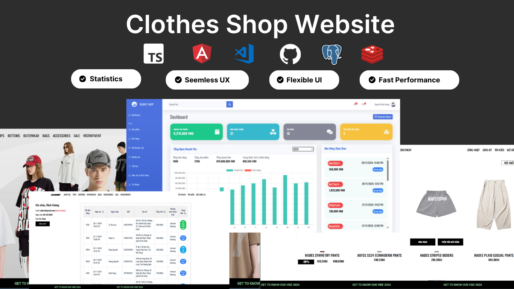

# SQ&BE Shop - E-commerce Website

## 1. Introdution
An E-ecommerce website I clone from a website named [hades.vn](https://hades.vn/#l=vi)  and tried to make the functionalities as similar to the original site as possible.
The project consists of two main parts:
- **API**: Backend built with ASP.NET Core, providing APIs for account management, products, orders, shopping cart, payments, blogs, banners,...
- **Client**: Frontend built with Angular, providing user interface for customers and admin
## 2. Technologies
- **Backend**:
    - ASP.NET Core Web API
    - Entity Framework Core
    - PostgreSQL
    - Redis
    - JWT & Cookie Authentication
    - MailKit
    - Cloudinary
    - AutoMapper
- **Frontend**:
    - Angular 17
    - PrimeNG
    - RxJS
    - Bootstrap 5
    - ngx-quill(rich text editor)
- **Test**: Cypress (E2E test)
## 3. Features
#### Guest
- Register, login (with email verification), login with google
- View product list, product details
- Filter products by color, size, price,...
- Create and manage cart
- Payment via:
    - VNPAY (Internet Banking)
    - PayPal (USD)
    - COD (Cash on delivery)
- Apply promo code at checkout
#### User
- Manage favorite products list
- View purchase history and track order status
- Reset password via email
#### Administrator
- View sales statistics
    - Current Month Revenue
    - Current Month Total Orders
    - Yearly Revenue Overview
    - List of Undelivered Orders
    - List of Best Selling Products
    - Sales by Category
- Manage products and product variants quantity
- Manage categories, colors, sizes
- Manage orders and statuses
- Manage users, blogs and promo code
## 4. Demo
